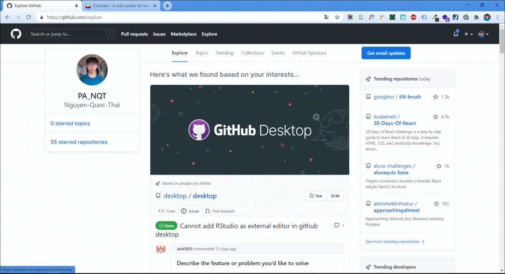

# smart-bookmark

A simple Chrome ext for bookmarking urls

#### GIF

##### You can clone this project or download the [release version](https://github.com/Nguyen-Quoc-Thai/smart-bookmark/releases/tag/v1)

### Setup
1. Setup API server (Mock API)
2. Load to Chrome Store

> See detailed setup steps at: [https://r2wteam.wordpress.com/2021/01/25/cach-viet-mot-chrome-extension](https://r2wteam.wordpress.com/2021/01/25/cach-viet-mot-chrome-extension)
